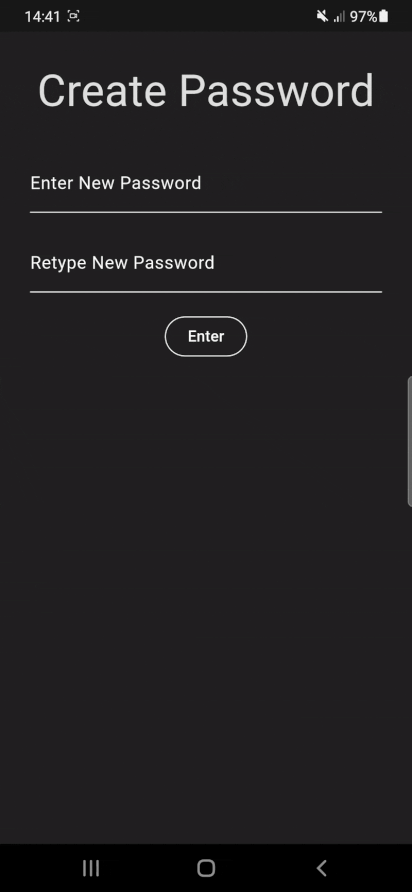
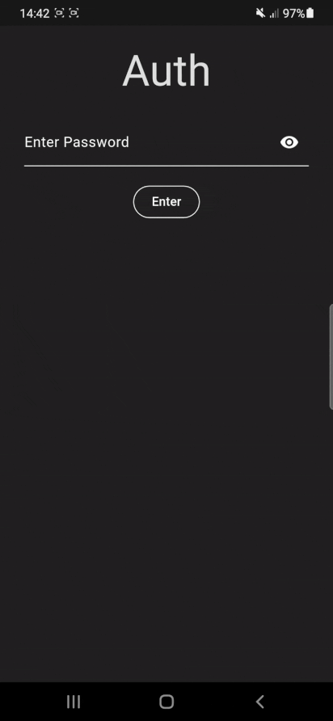
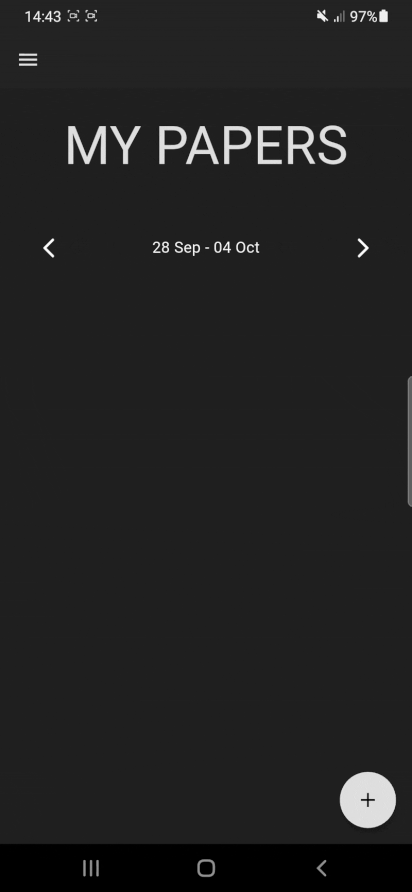
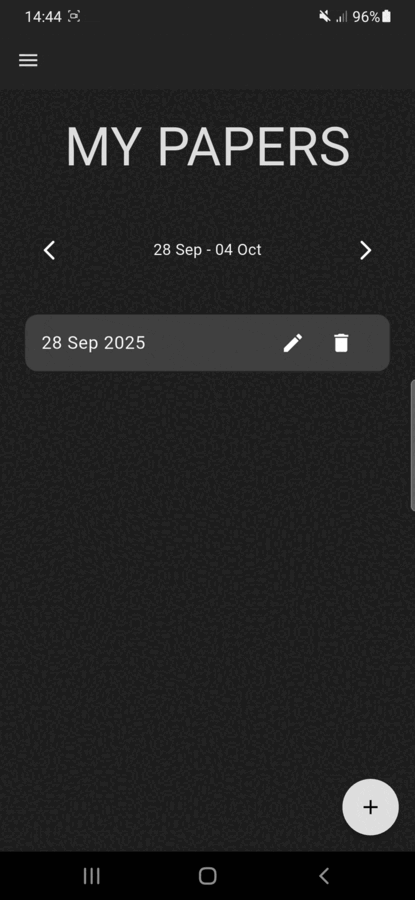

# MyPapers

**MyPapers** is a **Flutter**-based **digital journaling app** that allows users to write notes which are securely **encrypted** using **AES-256**. 

---

## Key Features

* **Robust Encryption:** All notes are secured using the **Advanced Encryption Standard (AES)**, specifically **AES-256**, ensuring your personal thoughts remain private.
* **Intuitive Filtering:** Easily find your notes using a built-in **calendar and date-based filtering** mechanism.
* **Full CRUD Functionality:** Seamlessly **create, read, update, and delete** your journal entries.

---

## Demo

### Create password

### Auth with password

### CRUD journal

## Tools used

* Dart/Flutter  
* Provider : State management  
* ObjectBox : Embeded database  
